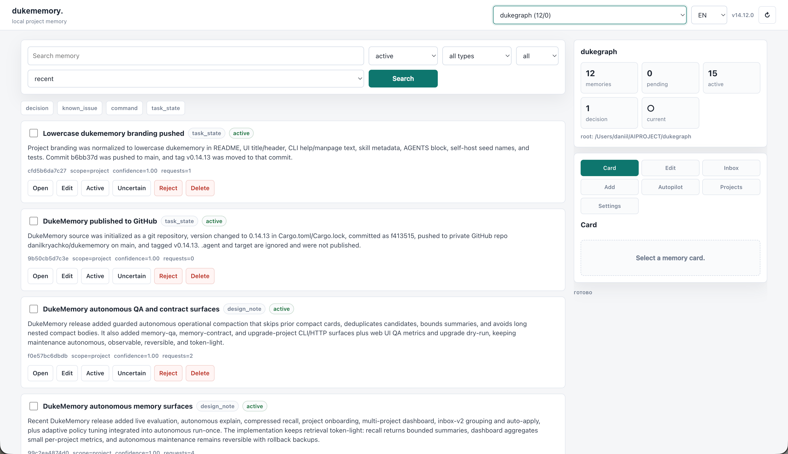

# dukememory.

[](LICENSE)
[](Cargo.toml)
[](#mcp-and-codex)
[](#local-first)
[](TRADEMARKS.md)


**Project memory for AI coding agents.**

`dukememory` is a local memory layer for Codex, Claude, Cursor, and other
coding agents. It keeps the project knowledge that should survive across chats:
decisions, constraints, commands, known issues, task state, user preferences,
and design notes.

It is built for one job: give agents the smallest useful context before they
touch code, without dumping chat history into every prompt.



## Why

Coding agents forget important project context. Long prompts waste tokens.
Transcript-based memory quickly turns into noise.

`dukememory` gives you:

- durable project memory in `.agent/memory.db`
- tiny task briefs before coding
- file and symbol impact checks before edits
- structured cards instead of chat dumps
- local-first storage with optional semantic recall
- a web UI to inspect, edit, and audit memory
- an MCP server and Codex skill for agent-native use
- autonomous maintenance with rollback-friendly operations

## What It Remembers

| Memory | Examples |
| --- | --- |
| Goals | product direction, project purpose |
| Decisions | accepted architecture or UX choices |
| Constraints | rules the agent must keep following |
| Commands | build, test, deploy, setup commands |
| Known issues | bugs, risks, caveats, fragile paths |
| Task state | where work stopped and what is next |
| Design notes | implementation details worth reusing |

## How It Works

1. Store durable facts as typed memory cards.
2. Retrieve a compact `brief` at the start of a task.
3. Retrieve `impact` memory for files, symbols, or subsystems before editing.
4. Use SQLite FTS by default, or add embeddings for semantic recall.
5. Keep memory healthy with observable, reversible autonomous maintenance.

The result is less repeated explanation, fewer forgotten constraints, and lower
context cost.

## Install

```bash
cargo build --release

target/release/dukememory update-install \
  --from target/release/dukememory \
  --to ~/.local/bin/dukememory
```

## Quick Start

```bash
cd /path/to/project

dukememory onboard --root . --install-autonomous
dukememory install-skill
dukememory memory-contract --write
```

## Daily Commands

```bash
dukememory brief "fix checkout validation" --budget-profile tiny
dukememory impact src/checkout.ts --budget-profile tiny
dukememory recall "checkout validation" --max-chars 1200
dukememory drift --root . --json
```

Save durable knowledge:

```bash
dukememory add decision \
  "Checkout validation stays client-side first" \
  "Server validation remains authoritative; client validation improves feedback." \
  --link file:src/checkout.ts

dukememory embed-index
```

## Local First

`dukememory` stores data in the project by default:

```text
.agent/memory.db
.agent/config.toml
.agent/MEMORY_CONTRACT.md
```

No cloud service is required. Embeddings are optional.

## Embeddings

```bash
export DUKEMEMORY_EMBED_PROVIDER=ollama
export DUKEMEMORY_EMBED_ENDPOINT=http://localhost:11434
export DUKEMEMORY_EMBED_MODEL=bge-m3:latest

dukememory embed-index
dukememory embed-status --json
```

## Web UI

```bash
dukememory serve-http --host 127.0.0.1 --port 8765
```

Open `http://127.0.0.1:8765/`.

Use it to search memory, inspect evidence, review inbox items, watch usage, and
check autonomous health.

For one compact health view:

```bash
dukememory ops-status --json
```

It combines usage, usefulness, quality, embeddings, autonomous maintenance, and
local-first multi-device readiness. When no manual feedback exists, live
usefulness is inferred from successful agent memory reads. Empty agent reads are
surfaced as memory gaps, and autonomous maintenance can turn unresolved gaps into
pending inbox suggestions instead of silently creating noisy memory. Weak,
unused, oversized, or unlinked cards can also be surfaced as low-confidence
quality-review inbox items for safe cleanup. Duplicate detection avoids
versioned release/history false positives. Successful and empty agent reads can
be materialized as lightweight inferred feedback during autonomous maintenance,
and unresolved missing feedback signals also feed gap inbox suggestions. Release
history, long operational cards, and the project contract are bounded separately
to keep memory lean. Resolved quality-review inbox items are closed
autonomously when the underlying card is no longer weak.

## MCP And Codex

```bash
dukememory serve-mcp
dukememory install-skill
dukememory codex-doctor --json
```

Agent rule: read `brief`, use `impact`, run `drift` before broad edits, write
only durable outcomes, then re-index embeddings after important writes.

## Autonomous Maintenance

```bash
dukememory autonomous install --force --level normal
dukememory autonomous status --json
dukememory autonomous rollback --json
```

## Development

```bash
cargo fmt --check
cargo test
cargo test --features vec
cargo clippy --all-targets --all-features -- -D warnings
cargo build --release
```

## License

Apache-2.0.

## Brand

The code is licensed under Apache-2.0, but the `dukememory` name, wordmark,
screenshots, and project branding are not licensed for use in derivative
products or services. See [TRADEMARKS.md](TRADEMARKS.md).
