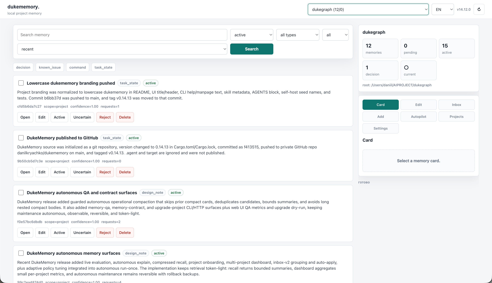

# dukememory

[](LICENSE)
[](Cargo.toml)
[](#mcp-and-codex)
[](#local-first)
[](TRADEMARKS.md)


**Local-first memory for AI coding agents.**

[GitHub](https://github.com/danilkryachko/dukememory)

`dukememory` is a Rust CLI, MCP server, and Codex skill that gives Codex,
Claude, Cursor, and other AI coding agents durable project memory. It stores
decisions, constraints, commands, known issues, task state, user preferences,
and design notes in local SQLite, with optional semantic search through
embeddings.

It is built for one job: give agents the smallest useful context before coding,
without dumping chat history into every prompt or slowing development down.



## Why

Coding agents forget important project context. Long prompts waste tokens.
Transcript-based memory quickly turns into noise.

`dukememory` gives them a compact, searchable memory layer:

- **Local-first storage** in `.agent/memory.db` with SQLite and FTS.
- **Agent-native access** through an MCP server, Codex skill, CLI, and web UI.
- **Structured memory cards** for decisions, constraints, commands, issues, and task state.
- **Small context briefs** before coding, including file and symbol impact checks.
- **Local semantic recall** with MiniLM embeddings, plus optional Ollama or OpenAI-compatible providers.
- **Autonomous maintenance** for freshness, backups, repair hints, gap review, and safe cleanup.
- **Grounded answers** from memory with cited card ids and explicit gaps.
- **One-command Codex wiring** so future chats know memory is installed.
- **Lightweight control surfaces** for health scoring, explainable recall, effectiveness, baselines, safe conflict cleanup, governance, sync dry-runs, and release gates.

## What It Remembers

| Memory | Examples |
| --- | --- |
| Goals | product direction, project purpose |
| Decisions | accepted architecture or UX choices |
| Constraints | rules the agent must keep following |
| Commands | build, test, deploy, setup commands |
| Known issues | bugs, risks, caveats, fragile paths |
| Task state | where work stopped and what is next |
| Design notes | implementation details worth reusing |

## How It Works

1. Store durable facts as typed memory cards.
2. Retrieve a compact `brief` at the start of a task.
3. Retrieve `impact` memory for files, symbols, or subsystems before editing.
4. Use SQLite FTS by default, or add embeddings for semantic recall.
5. Keep memory healthy with observable, reversible autonomous maintenance.
6. Review changed files against memory before saving new durable context.

The result is less repeated explanation, fewer forgotten constraints, and lower
context cost.

## Install

Published releases include native Linux/macOS archives and a combined
`SHA256SUMS` manifest. Verify the archive checksum before installing. For a
source build with the production vector backend:

```bash
cargo build --locked --release --features vec

target/release/dukememory update-install \
  --from target/release/dukememory \
  --to ~/.local/bin/dukememory
```

## Quick Start

```bash
cd /path/to/project

dukememory onboard --root . --install-autonomous
dukememory install-skill
dukememory memory-contract --write
```

## Daily Commands

```bash
dukememory brief "fix checkout validation" --budget-profile tiny
dukememory impact src/checkout.ts --budget-profile tiny
dukememory recall "checkout validation" --max-chars 1200
dukememory recall "checkout validation" --recent --json
dukememory recall "checkout validation" --as-of 2026-07-01 --json
dukememory recall "checkout validation" --changed-since 2026-06-25 --json
dukememory recall "checkout validation" --changed-since-days 7 --json
dukememory drift --root . --json
dukememory context-governor "fix checkout validation" --target src/checkout.ts --json
dukememory answer "what should we remember about checkout validation?" --json
dukememory rag-debug "what should we remember about checkout validation?" --json
dukememory rag-answer "what should we remember about checkout validation?" --json
dukememory graph-rag "what decisions affect checkout validation?" --json
dukememory eval rag --json
dukememory explain-recall "checkout validation" --json
dukememory memory-health-score --json
dukememory memory-eval-story --json
dukememory autonomous-usefulness --json
dukememory autonomous-supervisor --json
dukememory fleet-supervisor --json
dukememory fleet-supervisor-watch-install --dry-run --json
dukememory benchmark-polish --json
dukememory recall-benchmark-suite --json
dukememory memory-effectiveness-v2 --json
dukememory recall-benchmark-baselines --json
dukememory import-review docs/project-notes.md --json
dukememory memory-upload docs/project-notes.md --json
dukememory memanto-gap-report --json
dukememory memory-timeline <memory-id> --json
dukememory memory-conflict-review --json
dukememory memory-conflict-apply --json
dukememory memory-diff-review --json
```

Save durable knowledge:

```bash
dukememory add decision \
  "Checkout validation stays client-side first" \
  "Server validation remains authoritative; client validation improves feedback." \
  --link file:src/checkout.ts

dukememory embed-index
```

## Local First

`dukememory` stores data in the project by default:

```text
.agent/memory.db
.agent/config.toml
.agent/MEMORY_CONTRACT.md
```

No cloud service is required. The default local profile uses MiniLM embeddings
stored in SQLite; semantic recall remains optional for projects that only need
FTS.

## Evidence-Backed Agent Sessions

Use one durable session id to connect task context, touched files, validation,
and the final result:

```bash
SESSION_ID=$(dukememory agent-session start \
  "implement checkout validation" \
  --target src/checkout.rs \
  --runner-profile codex_default)

OWNER="checkout-worker-1"
CLAIM=$(dukememory agent-session claim "$SESSION_ID" \
  --owner "$OWNER" \
  --lease-secs 120 \
  --json)
LEASE_TOKEN=$(printf '%s' "$CLAIM" | jq -r .lease_token)

dukememory agent-session context "$SESSION_ID" \
  --owner "$OWNER" \
  --lease-token "$LEASE_TOKEN" \
  --json

dukememory agent-session event "$SESSION_ID" \
  --event-type runner_started \
  --detail '{"profile":"codex_default"}' \
  --event-id "runner-started-attempt-1" \
  --owner "$OWNER" \
  --lease-token "$LEASE_TOKEN" \
  --json

dukememory agent-session renew "$SESSION_ID" \
  --owner "$OWNER" \
  --lease-token "$LEASE_TOKEN" \
  --lease-secs 120 \
  --json

dukememory agent-session finish "$SESSION_ID" \
  --outcome success \
  --summary "implemented client and server validation" \
  --changed-file src/checkout.rs \
  --validation "cargo test --all-targets" \
  --owner "$OWNER" \
  --lease-token "$LEASE_TOKEN" \
  --json

dukememory agent-session trace "$SESSION_ID" --json

# Find interrupted sessions whose heartbeat has been quiet for five minutes.
dukememory agent-session recover --stale-after-secs 300 --json

# Atomically claim every recoverable session for a recovery worker.
dukememory agent-session recover \
  --stale-after-secs 300 \
  --owner "recovery-worker-1" \
  --lease-secs 120 \
  --json
```

`context` combines brief, optional target impact, and doctrine in one audited
read. A successful finish creates automatic `useful` feedback only when the
session recalled memory and includes explicit evidence: a changed file,
validation command, or commit. Exact finish retries are safe; a conflicting
second finish is rejected. `failed`, `partial`, and `abandoned` outcomes never
produce automatic positive feedback.

External orchestrators should claim a session before loading context. A live
lease fences context, event, renew, release, and finish mutations to one owner
and opaque token; after release or expiry, a new claim creates a new attempt.
Unclaimed sessions remain compatible with the 0.39 lifecycle. Recovery never
returns a session with an unexpired lease.

Orchestrators can record bounded JSON-object events with `agent-session event`;
every accepted event refreshes session activity in the same transaction.
`--event-id` makes delivery retry-safe: an exact retry returns the existing
result, while reusing the id with another type or payload fails closed.
Supported events are `heartbeat`, `runner_selected`,
`runner_started`, `runner_completed`, `runner_failed`, `validation`, and
`recovery`. Trace v2 includes ordered event sequences, attempt attribution,
lease/heartbeat metrics, runner failures, evidence counts, and effectiveness.
The same operations are exposed as `memory_session_claim`,
`memory_session_renew`, `memory_session_release`, `memory_session_event`, and
`memory_session_recover` over MCP and under `/agent-sessions/*` over HTTP.

### DukeAgent 0.40 Integration

DukeAgent uses the session lifecycle as its primary long-term coordination
layer: it starts or resumes a session, claims a fenced attempt, loads audited
context, selects an available named runner profile, renews the lease before
heartbeat events, captures workspace/validation/commit evidence, and finishes
once with a causal trace. A second worker cannot resume the task while its
lease is live. Runner failure and cancellation never create automatic positive
feedback.

Named runner profiles are built in and may be overridden in
`.agent/runner-profiles.toml`:

```bash
dukememory runner-profile list --json
dukememory runner-profile doctor --json
dukememory runner-profile init --json
dukememory runner-profile init --apply --json
```

The defaults are `codex_default`, `gemini_flash_high`,
`antigravity_pro_high`, and `ollama_local`. Profile doctor checks command
availability without executing external runners.

## Local-First Sync

Remote or VDS sync is optional and remains local-first: agents keep reading the
local SQLite database, while push/pull moves reviewable sync bundles.

```bash
dukememory remote-sync-control --target /mnt/vds/dukememory --json
dukememory vds-sync-pack --target /mnt/vds/dukememory --json
umask 077
openssl rand -base64 48 > .agent/sync-passphrase
export DUKEMEMORY_SYNC_PASSPHRASE_FILE=.agent/sync-passphrase
dukememory sync push /mnt/vds/dukememory --encrypt --dry-run --json
dukememory sync push /mnt/vds/dukememory --encrypt --json
dukememory sync status /mnt/vds/dukememory --json
dukememory sync pull /mnt/vds/dukememory --policy manual --dry-run --json
dukememory sync recover /mnt/vds/dukememory --json
```

`--encrypt` writes an authenticated age/scrypt container atomically with mode
`600`. Pull and status auto-detect the `.age` bundle; encrypted imports create
encrypted rollback files and still apply the existing checksum, dry-run, and
conflict-policy checks. Use either `DUKEMEMORY_SYNC_PASSPHRASE` or the preferred
`DUKEMEMORY_SYNC_PASSPHRASE_FILE` (mode `600`), never both. Plain JSON export
and push remain available for compatibility and must stay on private storage.

Every versioned bundle carries a generation and parent generation. Successful
push/pull operations remember the last observed generation locally, so a stale
client cannot overwrite a newer remote by accident. Push uses a short lease
lock, recovers expired locks, preserves the previous verified generation, and
performs checksum read-back. `sync status` reports generation drift, active
locks, corruption, and recovery availability. Use `sync recover` to restore the
verified previous generation; use `sync push --force` only after intentionally
reviewing an untracked or corrupt remote.

`remote-sync-v2 --target PATH --apply --json` now performs the encrypted push
and decrypts the stored result for checksum read-back verification. Without
`--apply` it returns the guarded command sequence without moving data.

`web-control-center-v5` exposes the same model for UI buttons: preview first,
apply only guarded reversible actions, and keep rollback hints visible.

## Embeddings And Local RAG

```bash
export DUKEMEMORY_EMBED_PROVIDER=local
export DUKEMEMORY_EMBED_ENDPOINT=local
export DUKEMEMORY_EMBED_MODEL=paraphrase-multilingual-MiniLM-L12-v2

dukememory embed-index
dukememory embed-status --json
dukememory vec-validate --backend json
dukememory vec-index --json
dukememory vector-bench --iterations 100 --warmup 10 --limit 10000 --json
dukememory vector-bench --iterations 100 --limit 10000 \
  --baseline .agent/vector-bench-baseline.json --write-baseline --json
dukememory vector-bench --iterations 100 --limit 10000 \
  --baseline .agent/vector-bench-baseline.json \
  --max-regression-percent 25 --json
```

The default build keeps application-side cosine search as a portable fallback.
Build with `--features vec` to statically register sqlite-vec and run memory and
RAG cosine distance inside SQLite. `vec-validate --backend sqlite-vec` executes
both a native SQL distance check and a real `vec0` KNN probe; `embed-search
--backend json` can still force the fallback for comparison. The legacy
`vec-migrate` spelling remains a hidden CLI alias for compatibility.

The vec-enabled build maintains persistent dimension-specific `vec0` indexes
for both memory cards and RAG chunks. Existing JSON embeddings are backfilled on
open, insert/update/delete triggers keep row ids synchronized, and startup
health checks reconstruct missing triggers, stale registries, invalid virtual
tables, and missing/orphaned row memberships. `vec-index --json` exposes these
checks; `vec-index --rebuild` remains available for an explicit rebuild.
`vector-bench` reports exact sample size, warmup, p50/p95/p99 latency, QPS, and
JSON/vec0 top-match equivalence. A reviewed baseline can gate both p95 latency
growth and QPS loss with a non-zero exit on regression. Internal semantic flows fall back to the JSON
scorer if a native query fails; an explicitly requested
`--backend sqlite-vec` remains strict so operational checks cannot hide damage.

RAG commands use the same embedding provider for memory cards and can be
inspected before generation. `embed-index` also embeds indexed source chunks,
so semantic RAG can retrieve file evidence even when exact FTS terms are weak.
Text/code files can also be indexed as local source chunks:

```bash
dukememory rag-ingest README.md --json
dukememory rag-ingest README.md --apply --embed --json
dukememory rag-sources --json

dukememory rag-debug "what changed in checkout validation?" \
  --budget-profile tiny \
  --json

dukememory rag-answer "what changed in checkout validation?" \
  --budget-profile normal \
  --json

dukememory graph-rag "which memory cards are related to checkout validation?" \
  --budget-profile normal \
  --json

dukememory eval rag \
  --budget-profile tiny \
  --json
```

`eval rag` checks the retrieval/source-pack half of RAG without running
generation. Stored eval cases are used when present; otherwise it runs temporary
self-probes from active memory cards so a project can still detect source-pack
regressions before explicit benchmark cases are written. Each case reports the
same packed source selection diagnostics as `rag-debug`, including selected
chunk counts and overlap/file-cap suppression. Failing cases also distinguish
expected evidence that was selected, suppressed by packing, or missing from the
retrieved candidates. It also builds a deterministic grounded answer from the
selected source pack and checks that expected evidence reaches the answer with a
valid selected citation. The top-level `packing` and `grounded_answers`
summaries aggregate those counts across the whole eval run for release-gate
inspection.
Chunked RAG sources provide file/document evidence for answers, while durable
decisions and constraints should still be saved as reviewed memory cards.
The same source-chunk indexing path is exposed to agents as MCP
`memory_rag_ingest` and to the local web API as `POST /rag-ingest`; both remain
dry-run unless `apply` is explicitly true.
Use `rag-sources`, MCP `memory_rag_sources`, or HTTP `GET /rag-sources` to
verify that indexed files are still present, fresh, backed by chunks, and backed
by current semantic chunk embeddings for the configured embedding provider.
If `--embed` is omitted during ingest, run `dukememory embed-index` before
relying on semantic chunk recall. `--embed` refreshes only the source chunks
touched by that ingest pass. Re-ingesting unchanged sources leaves existing
chunks in place and preserves current chunk embeddings; `embed-index` remains
the full repair command.
The same RAG source-pack recall is surfaced in `memory-eval-story`,
`benchmark-polish`, and the required `release-gate-v3` check
`rag_source_pack_eval`, whose detail includes the aggregate `eval rag` packing
and grounded-answer summaries.
`rag-answer`, `rag-debug`, and `graph-rag` JSON reports include a compact
`trace` array with ranked evidence ids, scores, reasons, and chunk file
locations when source chunks are used. RAG source packing also suppresses
heavily overlapping chunks from the same file and caps selected chunks per file
so the prompt carries broader evidence instead of repeated context. The JSON
`packing` report shows candidate/selected counts and chunk suppression counts
overall and per file. Generated RAG answers expose a `generation_guard` report
with `answer_source`, selected citations seen in generated text, and the
fallback reason when the local model output is empty, prompt-shaped, or uncited.

For fully local generation, configure `provider = "local-llama"` in
`.agent/config.toml` and build with local generation support:

```bash
CMAKE_C_COMPILER_LAUNCHER=/usr/bin/env \
CMAKE_CXX_COMPILER_LAUNCHER=/usr/bin/env \
CMAKE_OBJC_COMPILER_LAUNCHER=/usr/bin/env \
CMAKE_OBJCXX_COMPILER_LAUNCHER=/usr/bin/env \
CMAKE_BUILD_PARALLEL_LEVEL=4 \
cargo build --features local-embeddings,local-generation
```

The current lightweight local generation profile uses
`HuggingFaceTB/SmolLM2-360M-Instruct-GGUF` with
`smollm2-360m-instruct-q8_0.gguf`. Tiny models can produce short or uncited
answers, so `rag-answer` and `graph-rag` require selected citation ids and
return a grounded extractive fallback with citations when generated output is
too weak or uncited.

Ollama and OpenAI-compatible embedding providers are still supported:

```bash
export DUKEMEMORY_EMBED_PROVIDER=ollama
export DUKEMEMORY_EMBED_ENDPOINT=http://localhost:11434
export DUKEMEMORY_EMBED_MODEL=bge-m3:latest

dukememory embed-index
```

## Web UI

```bash
dukememory serve-http --host 127.0.0.1 --port 8765
```

Open `http://127.0.0.1:8765/`.

Loopback access needs no token. Binding to a non-loopback address is refused
unless a bearer token is configured. Prefer a permission-restricted token file
so the secret does not appear in the process list:

```bash
umask 077
openssl rand -hex 32 > .agent/http-token
dukememory serve-http --host 0.0.0.0 --port 8765 \
  --auth-token-file .agent/http-token
```

`--auth-token` and `DUKEMEMORY_HTTP_TOKEN` remain available for compatibility;
`DUKEMEMORY_HTTP_TOKEN_FILE` is the environment equivalent of the file option.
API clients send `Authorization: Bearer ...`; the web UI asks once and keeps it
in session storage. State-changing browser requests are restricted to the
request host. Extra trusted origins can be listed, comma-separated, in
`DUKEMEMORY_HTTP_ALLOWED_ORIGINS`.

The built-in server is plain HTTP. Terminate TLS at a trusted reverse proxy
(for example Caddy or nginx) whenever traffic leaves the host, preserve the
original `Host` header, and restrict network access with a firewall. Access
events are emitted as one-line JSON on stderr. SIGINT, SIGTERM, and SIGHUP stop
accepting new connections, drain the bounded worker queue, and join workers
before exit.

Ready-to-adapt systemd, Caddy, and nginx templates plus verification steps are
in [`docs/production-deployment.md`](docs/production-deployment.md).

Use it to search memory, inspect evidence, review inbox items, watch usage,
check autonomous health, explain recall, inspect the project intent map, run
retrieval probes, tune ranking, route project memory, and review gaps.

For one compact health view:

```bash
dukememory ops-status --json
```

It combines usage, usefulness, quality, embeddings, autonomous maintenance, and
local-first multi-device readiness. Memory gaps become reviewable suggestions
instead of noisy automatic writes.

## MCP And Codex

```bash
dukememory serve-mcp
dukememory install-skill
dukememory connect-codex --apply --json
dukememory codex-doctor --json
```

Agent rule: read `brief`, use `impact`, run `drift` before broad edits, write
only durable outcomes, then re-index embeddings after important writes.

## Autonomous Maintenance

```bash
dukememory autonomous install --force --level normal
dukememory autonomous-watch-install --dry-run --json
dukememory watch-control --json
dukememory autonomous status --json
dukememory autonomous rollback --json
```

## Control Surfaces

```bash
dukememory context-governor "ship auth fix" --target src/auth.ts --json
dukememory memory-router "auth decisions" --include-siblings --json
dukememory memory-health-score --json
dukememory explain-recall "auth decisions" --json
dukememory project-intent-map --json
dukememory memory-test-harness --json
dukememory agent-audit-v2 --json
dukememory memory-control-center --json
dukememory auto-supersede-v2 --json
dukememory memory-diff-apply --json
dukememory recall-benchmark-suite --json
dukememory release-gate-v2 --json
dukememory memory-effectiveness-v2 --json
dukememory recall-benchmark-baselines --json
dukememory memory-conflict-apply --json
dukememory memory-governance-policy --json
dukememory autonomous-loop-v2 --json
dukememory governance-enforce --json
dukememory memory-quality-ci --json
dukememory fleet-dashboard-v2 --json
dukememory remote-sync-apply-flow --target /mnt/vds/dukememory --json
dukememory mcp-tool-surface-v2 --json
dukememory mcp-tool-surface-v3 --json
dukememory autopilot-v3 --json
dukememory self-learning-retrieval --json
dukememory project-role-profile --json
dukememory inbox-ai-reviewer --json
dukememory web-control-center-v3 --json
dukememory remote-sync-apply --target /mnt/vds/dukememory --json
dukememory mcp-quality-tools --json
dukememory remote-sync-control --target /mnt/vds/dukememory --json
dukememory web-control-center-v4 --json
dukememory mcp-discipline-v2 --json
dukememory mcp-discipline-v3 --json
dukememory feedback-loop-v2 --json
dukememory upgrade-all-projects-v2 --dry-run --json
dukememory fleet-quality --json
dukememory vds-sync-pack --target /mnt/vds/dukememory --json
dukememory web-control-center-v5 --json
dukememory quality-autopilot-v31 --json
dukememory memory-router-v2 "project memory" --include-siblings --json
dukememory benchmark-profiles --json
dukememory install-polish --json
dukememory memory-effectiveness-lab --json
dukememory auto-context-budgeter-v2 "project memory" --json
dukememory memory-contract-v2 --json
dukememory cross-project-learning "project memory" --json
dukememory agent-trace --json
dukememory vds-sync-hardening --target /mnt/vds/dukememory --json
dukememory install-quality --json
dukememory web-control-center-v6 --json
dukememory answer "project memory" --json
dukememory connect-codex --json
dukememory memory-type-guide --json
dukememory memory-eval-story --json
dukememory import-review README.md --json
dukememory memory-upload README.md --json
dukememory memanto-gap-report --json
dukememory web-control-center-v7 --json
dukememory autonomous-usefulness --json
dukememory benchmark-polish --json
dukememory web-control-center-v8 --json
dukememory autonomous-supervisor --json
dukememory web-control-center-v9 --json
dukememory fleet-supervisor --json
dukememory web-control-center-v10 --json
dukememory fleet-supervisor-watch-install --dry-run --json
dukememory web-control-center-v11 --json
dukememory release-gate-v3 --json
dukememory web-control-center --json
dukememory agent-session status --json
dukememory runner-profile doctor --json
dukememory auto-ranking-tune --apply --json
dukememory ranking-profile --profile balanced --apply --json
dukememory project-template --kind rust-cli --apply --json
dukememory sync-profile --profile local-first-backup --run-dry-run --json
dukememory remote-sync-wizard --target /mnt/vds/dukememory --json
dukememory remote-sync-v2 --target /mnt/vds/dukememory --json
dukememory autonomy-control-center --json
dukememory upgrade-all-projects --json
dukememory release-gate --run --json
```

These commands keep memory useful without making it heavy: health scoring shows
whether memory is worth trusting, explainable recall shows why cards were
selected, intent maps define project direction, probes measure retrieval quality,
safe supersede and diff apply keep durable cards clean, governance policy bounds
autonomous writes, sync stays local-first, and release gate v2 catches memory
regressions before publishing.

`memory-control-center` currently maps to V2. The stable `web-control-center`
returns a compact one-request snapshot with sessions and runner readiness; its
full diagnostic model remains pinned at `web-control-center-v12`. The UI loads
that versioned detail only on demand.
`autonomous-supervisor --apply` uses conservative, rollback-backed maintenance;
it reports inferred feedback candidates but never materializes them unless
`auto-feedback` is invoked explicitly.

## Development

```bash
cargo fmt --check
cargo test
cargo test --features vec
cargo clippy --all-targets --all-features -- -D warnings
cargo build --locked --release --features vec
scripts/release-smoke.sh target/release/dukememory
```

See [docs/releasing.md](docs/releasing.md) for the tag-driven GitHub release,
checksum, smoke-test, and crates.io publishing workflow.

## License

Apache-2.0.

## Brand

The code is licensed under Apache-2.0, but the `dukememory` name, wordmark,
screenshots, and project branding are not licensed for use in derivative
products or services. See [TRADEMARKS.md](TRADEMARKS.md).
