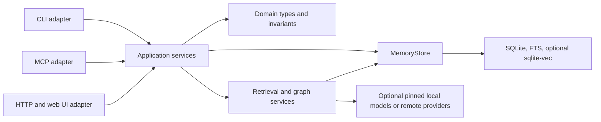

# Architecture

`dukememory` is a local-first Rust application with three adapters—CLI, MCP, and HTTP—over one application boundary and one SQLite store.

## Boundaries

- `src/domain.rs` owns memory type, scope, and status values. Invalid values cannot enter a mutation use case.
- `src/application.rs` is the adapter-facing use-case layer. Core create, update, status, delete, retrieval, and maintenance calls pass through it.
- `src/storage.rs` exposes the crate-private `MemoryStore`; SQLite details stay under `src/app/`.
- `src/operation_catalog.rs` maps stable core operations across CLI, MCP, and HTTP. The checked-in table is in [operations.md](operations.md).
- `src/http_api.rs` owns transport-neutral HTTP responses, status mapping, and response security headers.

Legacy maintenance and observability commands remain grouped under `src/app/`. New cross-surface behavior should enter through the application layer instead of adding independent mutation logic to each adapter.

## Write path and invariants

Every core mutation follows the same sequence:

1. The adapter parses transport data into typed domain values.
2. `MemoryApplication` invokes the core use case.
3. Central validation rejects empty content, invalid confidence, invalid enum values, and accidental secrets unless explicitly allowed.
4. `MemoryStore` writes the memory, links, and audit event in one SQLite transaction.
5. The adapter maps the result to its own response format.

HTTP maps bad input to `400`, missing resources to `404`, conflicts to `409`, and unexpected failures to `500`.

## SQLite lifecycle

The current schema version is stored in `schema_meta`. Migrations are version-gated and transactional; startup verifies critical tables, columns, indexes, triggers, and the final schema version. HTTP resolves the selected project once per request and opens one connection for that request. Process-local initialization caching avoids rerunning schema setup for an already verified database.

Graph edges live in `memory_edges` with foreign keys, uniqueness, confidence bounds, provenance, and atomic audit writes. Symmetric `relates_to` edges are canonicalized for storage and traversed in both directions.

## Retrieval policy

Retrieval loads a `RetrievalPolicy` once into `RetrievalQualitySignals`. The environment override `DUKEMEMORY_RANKING_PROFILE` wins; otherwise the policy comes from the selected database project's `.agent/ranking-profile.json`. Ranking never reads policy from the process working directory per result.

## Local model safety

The default local embedding model and built-in SmolLM2 generation presets use immutable Hugging Face revisions and verified SHA-256 digests. Tensor access is bounds- and type-checked, output dimensions are derived from the model output, and embedding engine initialization is separated from concurrent inference.

Custom `hf://` generation models support `hf://owner/repo@revision:file.gguf`. User-selected custom artifacts are not assigned a project-owned checksum; deployments should pin a revision and verify the artifact independently.

## Cargo feature matrix

| Build | Capabilities |
| --- | --- |
| default | FTS plus local MiniLM embeddings |
| `--no-default-features` | minimal FTS build without ONNX, tokenizer, or Hugging Face dependencies |
| `--features vec` | default capabilities plus sqlite-vec |
| `--all-features` | embeddings, sqlite-vec, and local llama.cpp generation |

## Extension rules

- Add domain values and invariants in `src/domain.rs` or the relevant application use case.
- Add a stable cross-surface operation to `CORE_OPERATION_CATALOG`, then update CLI/MCP/HTTP adapters from that definition and refresh `docs/operations.md`.
- Add schema changes as a new numbered migration and extend structural verification and migration tests.
- Keep external model downloads pinned and checksummed; keep their dependencies behind a Cargo feature.
- Put focused integration tests in a dedicated file under `tests/` rather than expanding the legacy compatibility matrix in `tests/cli.rs`.
