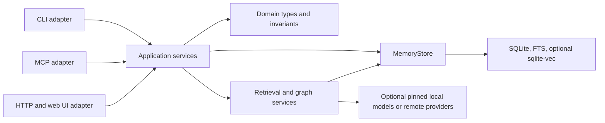

# Architecture

`dukememory` is a local-first Rust application with three adapters—CLI, MCP, and HTTP—over one application boundary and one SQLite store.

## Boundaries

- `src/domain.rs` owns memory type, scope, and status values. Invalid values cannot enter a mutation use case.
- `src/application.rs` is the adapter-facing use-case layer. Core create, update, status, delete, retrieval, and maintenance calls pass through it.
- `src/storage.rs` exposes the crate-private `MemoryStore`; SQLite details stay under `src/app/`.
- `src/operation_catalog.rs` maps stable memory, retrieval, RAG, release, and agent-session operations across CLI, MCP, and HTTP. The checked-in table is in [operations.md](operations.md).
- `src/http_api.rs` owns transport-neutral HTTP responses, status mapping, and response security headers.
- `src/app/mcp_transport.rs` owns bounded newline and Content-Length framing; `mcp_server.rs` owns JSON-RPC lifecycle, tool schemas, and dispatch, while `mcp_server/tasks.rs` owns durable task state and protocol-specific task results.
- `src/app/observability/release_gate.rs` owns release-gate v3 composition and effective RAG profiles; `rag_eval_summary.rs` isolates the lightweight web RAG snapshot from the broader observability module.
- `src/app/http_ingest_routes.rs` isolates project-contained file ingest routes from the broader HTTP diagnostic surface.

Legacy maintenance and observability commands remain grouped under `src/app/`. New cross-surface behavior should enter through the application layer instead of adding independent mutation logic to each adapter.

## Write path and invariants

Every core mutation follows the same sequence:

1. The adapter parses transport data into typed domain values.
2. `MemoryApplication` invokes the core use case.
3. Central validation rejects empty content, invalid confidence, invalid enum values, and accidental secrets unless explicitly allowed.
4. `MemoryStore` writes the memory, links, and audit event in one SQLite transaction.
5. The adapter maps the result to its own response format.

HTTP maps bad input to `400`, missing resources to `404`, conflicts to `409`, and unexpected failures to opaque `500` responses with incident ids. File ingest resolves canonical paths under the selected project root, and mutation-capable maintenance routes are preview-first.

## SQLite lifecycle

The current schema version is stored in `schema_versions`. Migrations are version-gated and transactional; startup verifies critical tables, columns, indexes, triggers, and the final schema version. HTTP resolves the selected project once per request and opens one connection for that request. Process-local initialization caching avoids rerunning schema setup for an already verified database. Unix database files and sidecars are mode `600`, newly created database directories are mode `700`, and SQLite uses `secure_delete=FAST`. The bundled runtime is gated at SQLite 3.51.3 or newer, and `DUKEMEMORY_SQLITE_DURABILITY` selects the explicit `balanced` or `strict` fsync profile.

Graph edges live in `memory_edges` with foreign keys, uniqueness, confidence bounds, provenance, and atomic audit writes. Symmetric `relates_to` edges are canonicalized for storage and traversed in both directions. Schema v24 adds valid time (`valid_from`/`valid_to`), knowledge time (`observed_at`), and an optional source observation. `memory_observations` keeps evidence kind/reference plus Git branch, commit, and worktree context, allowing an as-of graph to answer both “what was valid then?” and “what did the agent know then?”. File-backed observations encode a project-contained path, SHA-256, and size in the evidence reference; drift/review revalidate the latest observation and RAG generation excludes cards whose file evidence changed or disappeared without mutating their durable status. Schema v25 adds durable, lifecycle-scoped MCP task records; v26 adds exact-hash RAG trust promotion; v27 hash-chains audit events and retention checkpoints; v28 adds evidence-backed causal observation kinds. `temporal-graph --commit` resolves the knowledge cutoff from recorded evidence for an exact Git commit.

## Retrieval policy

Retrieval loads a `RetrievalPolicy` once into `RetrievalQualitySignals`. The environment override `DUKEMEMORY_RANKING_PROFILE` wins; otherwise the policy comes from the selected database project's `.agent/ranking-profile.json`. Ranking never reads policy from the process working directory per result.

RAG ingest prefers language-aware structural boundaries for supported text/code formats while retaining bounded line chunking as a fallback. Every selected RAG source carries a stable evidence reference and content hash; eval v7 separates retrieval ranking, deterministic extractive grounding, and generated-output guard fixtures while reporting development/holdout metrics and separate partition signatures. Baseline v3 binds results to both the canonical case corpus and retrieval configuration.

Prompt-injection triage is a pure library boundary in `src/rag_security.rs`.
Ingest keeps suspicious chunks for inspection, source health counts them as
quarantined, and both lexical and semantic retrieval exclude them before
ranking. The advanced eval reports memory-card provenance separately from
file-chunk provenance and runs a deterministic pre-retrieval attack-filter
fixture set; it does not claim protection from novel attacks or prove generated
answer safety.
The fixture is checked in and versioned independently from detector code. Text
is normalized for Unicode compatibility/format characters and common
homoglyphs, while bounded Base64 candidates are inspected before retrieval.
Clean source hashes remain explicitly unreviewed until operator promotion.

Advanced eval is deterministic and evidence-first. It audits only explicitly typed causal edges, treats poisoning matches as review candidates, measures global graph representation through connected components, and checks both valid-time and knowledge-time consistency. It does not infer causality, claim that heuristic matches prove compromise, or advertise hierarchical GraphRAG community summarization that the implementation does not provide.

## Transport and egress boundaries

MCP profiles bound the advertised tool surface; list cursors, Resources, and Tasks avoid forcing one large synchronous context exchange. The stable 2025 family keeps its initialize lifecycle. The locked `2026-07-28` release candidate uses per-request metadata and `server/discover`; its Tasks Extension is negotiated per request and is not wire-compatible with 2025 Tasks. Schema v25 stores tasks durably in SQLite, isolates them by client identity and lifecycle, and retains terminal results across MCP process restarts. Tool input is validated against closed, bounded Draft 2020-12 schemas before dispatch.

HTTP rejects ambiguous framing before reading the body and attaches a correlation id to every response/access event. Static tokens retain full/read compatibility, while a trusted OAuth/OIDC gateway supplies independently enforced read, write, maintenance, and filesystem scopes from explicit proxy CIDRs and publishes RFC 9728 protected-resource metadata. HTTP and MCP tool calls derive their required OAuth scope from the operation catalog. Bounded rate-limit identity storage plus global/per-client HTTP concurrency return `429` or `503` under pressure. MCP task workers have global and per-principal admission limits, and both sessions and durable tasks are principal-bound. The local UI loads same-origin CSS and JavaScript assets under a strict CSP with inline script/style execution disabled. Admission, stored-card scanning, and export redaction share structured secret signatures so one transport cannot bypass another's policy. HTTP and MCP framing parsers have property-based arbitrary-input and ambiguity coverage. Provider egress centrally validates HTTP(S) URLs, disables redirects, checks and pins DNS results, and blocks private, link-local, metadata, and special-use destinations unless explicitly allowed.

`scripts/architecture-budget.sh` caps growth in the remaining legacy
aggregation files (`app`, CLI parsing/dispatch, observability, MCP, HTTP routes,
diagnostics, and the large CLI integration suite). `tests/architecture_budget.rs`
also freezes the reviewed direct and optional runtime dependency counts. New work should continue extracting
cohesive modules (as the HTTP authorization, release-gate, and RAG-security
boundaries do) instead of raising those budgets.

## Local model safety

The default local embedding model and built-in SmolLM2 generation presets use immutable Hugging Face revisions and verified SHA-256 digests. Tensor access is bounds- and type-checked, output dimensions are derived from the model output, and embedding engine initialization is separated from concurrent inference.

Custom `hf://` generation models support `hf://owner/repo@revision:file.gguf`. User-selected custom artifacts are not assigned a project-owned checksum; deployments should pin a revision and verify the artifact independently.

## Cargo feature matrix

| Build | Capabilities |
| --- | --- |
| default | FTS plus local MiniLM embeddings |
| `--no-default-features` | minimal FTS build without ONNX, tokenizer, or Hugging Face dependencies |
| `--features vec` | default capabilities plus sqlite-vec |
| `--all-features` | embeddings, sqlite-vec, and local llama.cpp generation |

Release builds use stripped symbols, thin LTO, a single codegen unit, and no
incremental state. `release-minimal` switches to size optimization and fat LTO
for FTS/external-embedding servers; `scripts/reproducible-build-check.sh`
compares two isolated builds byte-for-byte with fixed timestamps and remapped
source paths.

## Extension rules

- Add domain values and invariants in `src/domain.rs` or the relevant application use case.
- Add a stable cross-surface operation to `OPERATION_CATALOG`, then update CLI/MCP/HTTP adapters from that definition and refresh `docs/operations.md`.
- Add schema changes as a new numbered migration and extend structural verification and migration tests.
- Keep external model downloads pinned and checksummed; keep their dependencies behind a Cargo feature.
- Put focused integration tests in a dedicated file under `tests/`; compatibility-only CLI tails may be included from `tests/cli/`, but new feature suites must not expand the legacy monolith.
